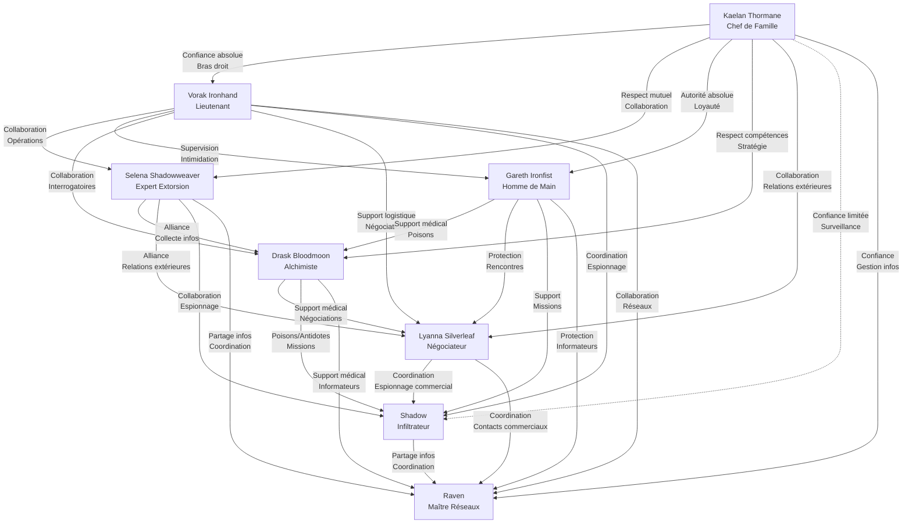

# Diagramme des Relations - Mafia Les Sangs de la Steppe

```mermaid
graph TD
    K[Kaelan Thormane<br/>Chef de Famille]
    
    V[Vorak Ironhand<br/>Lieutenant]
    S[Selena Shadowweaver<br/>Expert Extorsion]
    G[Gareth Ironfist<br/>Homme de Main]
    D[Drask Bloodmoon<br/>Alchimiste]
    L[Lyanna Silverleaf<br/>Négociateur]
    Sh[Shadow<br/>Infiltrateur]
    R[Raven<br/>Maître Réseaux]
    
    %% Relations depuis Kaelan (centre)
    K -->|Confiance absolue<br/>Bras droit| V
    K -->|Respect mutuel<br/>Collaboration| S
    K -->|Autorité absolue<br/>Loyauté| G
    K -->|Respect compétences<br/>Stratégie| D
    K -->|Collaboration<br/>Relations extérieures| L
    K -.->|Confiance limitée<br/>Surveillance| Sh
    K -->|Confiance<br/>Gestion infos| R
    
    %% Relations depuis Vorak (coordinateur)
    V -->|Collaboration<br/>Opérations| S
    V -->|Supervision<br/>Intimidation| G
    V -->|Collaboration<br/>Interrogatoires| D
    V -->|Support logistique<br/>Négociations| L
    V -->|Coordination<br/>Espionnage| Sh
    V -->|Collaboration<br/>Réseaux| R
    
    %% Relations spécialisées
    S -->|Alliance<br/>Collecte infos| D
    S -->|Alliance<br/>Relations extérieures| L
    S -->|Collaboration<br/>Espionnage| Sh
    S -->|Partage infos<br/>Coordination| R
    
    G -->|Support médical<br/>Poisons| D
    G -->|Protection<br/>Rencontres| L
    G -->|Support<br/>Missions| Sh
    G -->|Protection<br/>Informateurs| R
    
    D -->|Support médical<br/>Négociations| L
    D -->|Poisons/Antidotes<br/>Missions| Sh
    D -->|Support médical<br/>Informateurs| R
    
    L -->|Coordination<br/>Espionnage commercial| Sh
    L -->|Coordination<br/>Contacts commerciaux| R
    
    Sh -->|Partage infos<br/>Coordination| R
```

---
*Diagramme des relations - GN Krondaar 2026*

