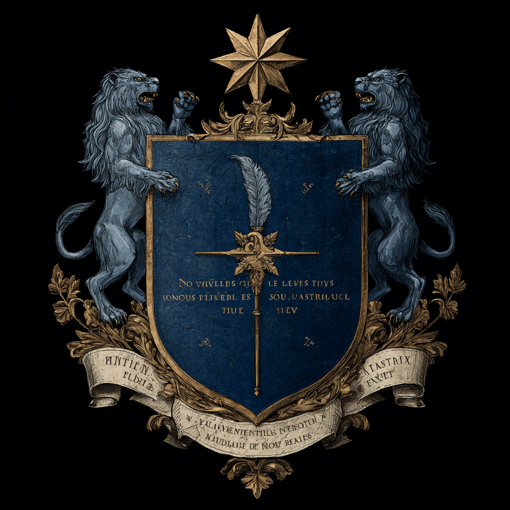

# l'Union Bancaire d'Il-Rion
« Notre union est un rempart, notre intégrité un trésor. »
Union, Bienveillance et Intégrité

 Sa réputation repose sur deux piliers :
•	Une discrétion absolue : les clients n’ont pas de noms dans ses registres, uniquement des numéros de comptes.
•	Une neutralité sans scrupule : la Banque ne juge pas l’origine des richesses qu’elle protège. Elle accepte l’or des marchands, des nobles, des guildes, mais aussi celui des pirates, des seigneurs de guerre, voire de cultes interdits.
Installée au centre de Ravenhold, la banque est à la fois crainte et respectée. Son nom inspire la confiance des uns, et la haine des autres. Beaucoup la considèrent comme une puissance politique à part entière, plus redoutable qu’un duché.
Elle détient des tonnes d’or, des artefacts puissants (dont certains proscrits), et des documents compromettants scellant des accords entre nobles, marchands et même cultistes. La chute de cette banque pourrait déclencher des révoltes, des guerres locales… ou l’ascension d’ennemis occultes.

# Histoire de l'Union Bancaire d'Il-Rion (UBI) au sein de la Confédération des cités libres du Levant

L'Union Bancaire d'Il-Rion (UBI), située dans la cité principale des îles-originelles de la confédération, est née il y a environ quatre siècles, au moment où les premières cités libres d'Il-Irion décidèrent de s'unir pour créer une confédération. Ce regroupement politique et économique avait pour but de renforcer la puissance commerciale et militaire des cités face à l'expansion grandissante de l'Empire Tchélène.

À l'époque, chacune des cités autonome disposait de ses propres institutions financières rudimentaires, souvent incapables de soutenir les ambitions commerciales à grande échelle nécessaires pour rivaliser avec les puissances continentales. Il était pourtant crucial d'organiser un système bancaire commun pour faciliter les échanges, accorder des crédits et financer les expéditions commerciales et militaires.

Ainsi, la naissance de la banque d'Il-Irion s'inscrit dans ce contexte d'unification économique des cités insulaires. Dotée du soutien politique des délégations commerciales venues des différentes cités, la banque s'imposa rapidement comme le centre névralgique financier de la confédération.

Elle joua un rôle fondamental dans le financement de la flotte et des mercenaires, sources clés de la richesse et de la sécurité des cités. La banque d'Il-Irion devint aussi un point d'appui pour prêter à des royaumes extérieurs, dont notamment l'Empire Tchélène, qui fit appel à ses ressources pour financer ses campagnes militaires.

Gouvernée par un conseil composé de cinq représentants, nommés par chacune des cités membres de la confédération, la banque d'Il-Irion fonctionne selon un mandat de cinq ans. Chaque cité élit son représentant, qui siège au conseil et prend part aux décisions stratégiques concernant l'allocation des fonds, les prêts et les investissements.

### Représentants actuels du conseil de l'UBI :
- **Il-Irion** : Lucien Thalmar, marchand influent et stratège financier.
- **Palyr** : Serin Valdor, ancien négociant en épices et diplomate.
- **Staal** : Marla Dervis, experte en commerce maritime.
- **Ther-îfels** : Joran Kevel, maître artisan et investisseur.
- **Cité libre d'Ascanir** : Falia Urven, héritière d'une famille de banquiers.

Le conseil se réunit régulièrement à la Citadelle d'Ulghart pour discuter et statuer sur les affaires majeures. C'est lors de la prochaine grande course annuelle de frégates, événement phare de la confédération, que le conseil de la banque doit être renouvelé. Ce changement de conseil s'annonce déjà comme une source majeure de tensions entre les cités, chacune cherchant à renforcer son influence et à placer ses candidats favoris.

Les enjeux sont immenses, car l'UBI contrôle les flux financiers essentiels à la puissance économique et militaire de la confédération. Ce renouvellement pourrait donc modifier profondément les équilibres internes et les alliances.

Au fil des siècles, l'UBI devint un pilier incontournable de la confédération grâce à une politique alliant prudence financière, réseau d'influence étendu et appui discret mais ferme aux stratégies militaires et commerciales communes.

# La citadelle d'Ulghart
Il y a un siècle, l’île d’Ulghart n’était qu’un promontoire rocheux battu par les vents, réputé pour ses grottes et ses galeries souterraines naturelles. Les premiers explorateurs découvrirent que ce réseau souterrain s’étendait sur des kilomètres, offrant des salles profondes et sèches, idéales pour entreposer des richesses à l’abri des pillards et des tempêtes.

C’est l’Union Bancaire d’Il-Irion (UBI) qui saisit l’opportunité : elle fit de l’île le site principal de stockage de ses coffres, creusant et aménageant les galeries pour y installer des salles de coffre sécurisées, protégées par des portes de métal et des enchantements. Rapidement, la sécurité et la discrétion du lieu attirèrent les plus grandes fortunes de la confédération.

Autour de la banque, la vie s’organisa : des taverniers ouvrirent des auberges pour accueillir les voyageurs et les gardes, des marchands installèrent leurs comptoirs pour profiter du flux d’or et de marchandises, des forgerons et artisans vinrent proposer leurs services à la banque et à la population croissante. La citadelle d’Ulghart devint un véritable carrefour commercial, où se mêlaient négociants, banquiers, aventuriers et espions.

Pour divertir et attirer encore plus de richesses, un casino fut construit au cœur de la citadelle, offrant jeux d’argent, spectacles et intrigues nocturnes. En moins d’un siècle, Ulghart passa d’un simple rocher isolé à une place forte incontournable, où l’or, le secret et le pouvoir se côtoient dans les salles voûtées et les ruelles animées.

<!- que pour les orga : >
# Magouilles au sommet : l'ombre du conseil sortant

Si le mandat de cinq ans du conseil actuel touche à sa fin lors de la prochaine course de frégates, c'est moins l'alternance attendue qui inquiète les représentants sortants que la perspective d'un audit sans complaisance. En effet, il est de règle que chaque nouveau conseil procède à une vérification complète des comptes et des archives, afin de marquer sa légitimité et de révéler les éventuelles irrégularités du mandat précédent.

Or, Lucien Thalmar, Serin Valdor, Marla Dervis, Joran Kevel et Falia Urven traînent derrière eux une série de décisions opaques et de détournements savamment orchestrés au fil du quinquennat. Habiles en affaires, ils ont su masquer l'existence d'un magot commun, alimenté par des commissions illicites et des prêts douteux, soigneusement dissimulé dans des opérations financières de façade.

La proximité du changement imminent les met désormais sous pression : tout indique que les nouveaux représentants, portés par la volonté de transparence des cités rivales, s'empresseront d'examiner scrupuleusement livres et correspondances. Pour éviter l'opprobre, il leur faut trouver au plus vite le moyen d'exfiltrer discrètement la part illicite de leur fortune avant l'arrivée du prochain conseil. Cette course contre-la-montre risque de fragiliser davantage les alliances et d'attiser les tensions déjà vives avant la grande course de frégates.

